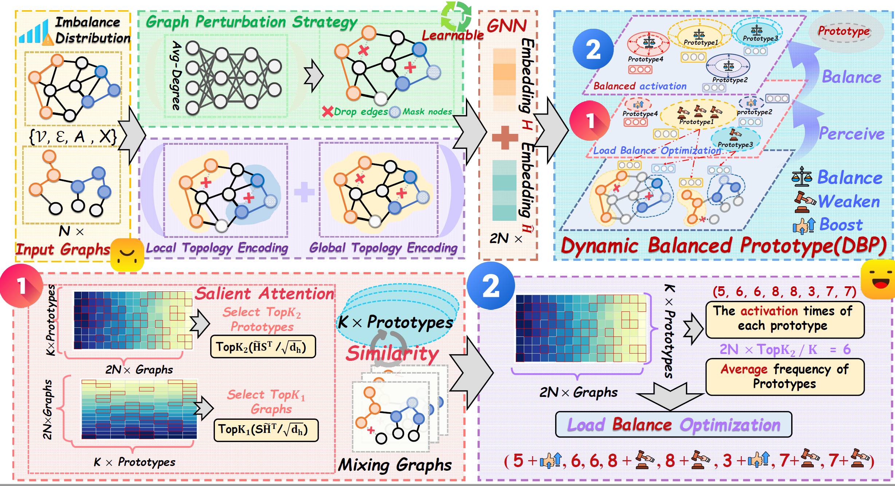

<div align="center">

# One for Two  
# A Unified Framework for Imbalanced Graph Classification via Dynamic Balanced Prototype

</div>
<p align="center">
  
  
</p>

We propose UniImb, a novel framework for imbalanced graph classification based on [PyTorch](https://pytorch.org/) and [PyTorch Geometric](https://www.pyg.org/), to address both types of imbalance in a uniform manner. UniImb first captures multi-scale topological features and enhances data diversity via learnable personalized graph perturbations. It then employs a dynamic balanced prototype module to learn representative prototypes from graph instances, improving the quality of graph representations. Concurrently, a prototype load-balancing optimization term mitigates dominance by majority samples to equalize sample influence during training. We justify these design choices theoretically using the Information Bottleneck principle. Extensive experiments on 19 datasets-including a large-scale imbalanced air pollution graph dataset AirGraph released by us and 23 baselines demonstrate that UniImb has achieved dominant performance across various imbalanced scenarios.

## 📝 Overall architecture of UniImb

<p align="center">

</p>

## Installation
You can easily reproduce the results of UniImb by following the steps below:

#### Environment Requirements

Please ensure your Python environment meets  following dependencies:

| Dependency        | Version (≥) |
| ----------------- | ------------|
| Python            | 3.11.11     |
| PyTorch           | 2.3.0       |
| PyTorch-Geometric | 2.6.1       |
| scipy             | 1.15.2      |

#### 💡 Install specific dependencies

```
pip install -r requirements.txt

```

## 🚀 Quick Start 

### `Dataset`

binary classification graph dataset: 
```
MUTAG, PTC-MR, DHFR, PROTEINS, D&D, REDDIT-B, AIDS, NCI1, FRANKENSTEIN, AirGraph
```

multi-class graph dataset: 
```
COLLAB, Synthie, IMDB-MULTI
```

These graph classification datasets are widely used benchmark datasets in Graph Neural Network (GNN) research. They can be automatically downloaded and loaded via [PyTorch Geometric](https://www.pyg.org/), without the need for manual downloading.

### `imbalance type`

Imbalance type:

```
'class', 'topology', 'intertwined class and topology imbalance'
```

### `Imbalance degrees`

Controls the severity of imbalance:

```
'low', 'medium', 'extreme'
```
### `scripts`

```
📁 main/: Contains the scripts for running the experiments on class-imbalance, topology-imbalance and intertwined class and topology imbalance.

📁 Split/: Contains the data preprocessing methods, including: (1) Topology Imbalance: Methods for handling topology imbalance in graph data. (2) intertwined class and topology imbalance: Methods for addressing intertwined imbalance scenarios.
```
### `Distribution`
In the Dynamic Balanced Prototype (DBP), there are four possible prototype activation distributions, each corresponding to a different optimization loss function. These distributions are provided in the Distribution folder.

```
Zipf, Poisson, Exponential, Uniform
```
Through experiments, we have validated that when the prototype activation distribution is Uniform, it performs the best in handling imbalanced graph classification.

### `backbone`
UniImb performs well across all backbones. We provide various backbones to choose from, with UniImb can significantly improve the performance of these backbones in imbalanced scenarios, demonstrating its scalability and practicability.

```
GIN, GCN, GraphSAGE, GraphGPS, Exphormer, Graph-Mamba
```

### Run

To reproduce results in Table 1, please run the following code:

```linux
bash Class.sh
```

To reproduce results in Table 2, please run the following code:
```linux
bash Topology.sh
```
## 📄 Citation

If you find this project helpful, please cite us:

```bibtex
@inproceedings{wangone,
  title={One for Two: A Unified Framework for Imbalanced Graph Classification via Dynamic Balanced Prototype},
  author={Wang, Guanjun and Wang, Binwu and Ma, Jiaming and Zhou, Zhengyang and Wang, Pengkun and Wang, Xu and Wang, Yang},
  booktitle={The Fourteenth International Conference on Learning Representations}
}
```
